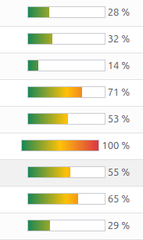

This module allows to display progress bars with colorized gradient bar.
The color will increase following value from green passing per yellow
and finishing to red.

- Normal rendering:

- Reverse rendering:

